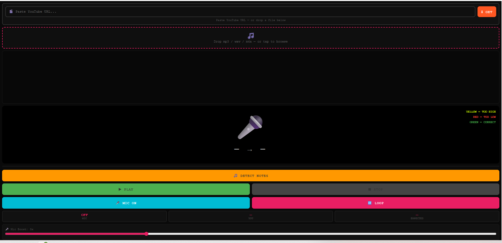

# 🎤 PitchPilot 1.0

A browser-only karaoke pitch trainer that combines high-performance ML note detection with real-time feedback.

### Core Features
* **Spotify's Basic Pitch:** ML note detection running fully in-browser.
* **AssemblyAI:** Word-level transcription (optional, API key required).
* **Web Audio API:** Real-time microphone pitch detection via autocorrelation.
* **RapidAPI:** `youtube-mp36` bridge for direct YouTube → MP3 downloads.

---

### 🛠 Architecture Overview
1.  **Ingestion:** User loads audio via file drop or YouTube URL.
2.  **Processing:** "Detect Notes" runs Basic Pitch and AssemblyAI in parallel.
3.  **Rendering:** Notes are converted to pill objects on a scrolling canvas timeline.
4.  **Playback:** RequestAnimationFrame (RAF) loop tracks song time and syncs lyrics.
5.  **Analysis:** Mic input is autocorrelated per frame into smoothed note names.
6.  **Feedback:** Real-time color feedback compares sung notes vs. expected notes.

---

### 📦 Dependencies
*All dependencies are served via CDN/ESM—no build step required.*

| Dependency | Version / Source | Link |
| :--- | :--- | :--- |
| **@spotify/basic-pitch** | 1.0.1 | [esm.sh](https://esm.sh/) |
| **AssemblyAI REST API** | v2 | [api.assemblyai.com](https://api.assemblyai.com/) |
| **youtube-mp36** | RapidAPI | [RapidAPI Hub](https://rapidapi.com/ytjar/api/youtube-mp36) |

---

### Contact & Support
If you have further questions, feel free to reach out on GitHub.

**Repo:** [PitchPilot](https://github.com/onlyGod-can-Intimidate-me/PitchPilot)  
**Author:** John Tsorotes
